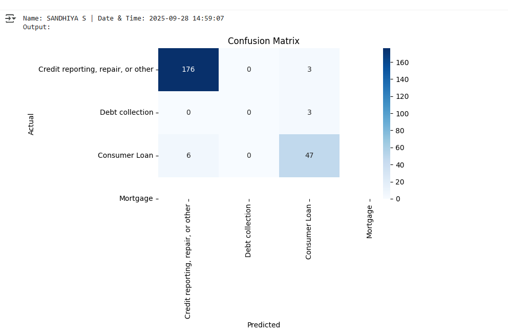

# Task-5-Data-Science-Kaiburr

## Candidate Name
SANDHIYA S

## Date
28-09-2025

## Objective
The main goal of this task was to build a model that can classify consumer complaints into multiple categories.

---

## Steps I Completed

1. **Exploring Data & Preparing Features**  
   - Selected the columns 'Product' and 'Consumer complaint narrative' from the dataset.  
   - Removed rows with missing values.  
   - Created a mapping of complaint categories to numbers (target_map).

2. **Text Processing**  
   - Converted complaint text into numbers using TF-IDF vectorization.  
   - Optional: converted text to lowercase and removed punctuation for better accuracy.

3. **Model Selection**  
   - Trained a classification model (like Logistic Regression or Naive Bayes) on the prepared data.

4. **Model Evaluation**  
   - Checked performance using a confusion matrix to see how well the model predicted each category.  

5. **Prediction**  
   - Tested the model with sample inputs.  
   - Output shows numeric predictions '[1, 1]' which correspond to the categories in 'target_map'.

---

## Notes on Predictions

- Numeric labels map to actual categories:  
  - 0 → Credit reporting, repair, or other  
  - 1 → Debt collection  
  - 2 → Consumer Loan  
  - 3 → Mortgage  

- Example sample predictions: 
 
"I found incorrect entries in my credit report." → 1 (Debt collection)
"The bank is harassing me for debt repayment." → 1 (Debt collection)

---

## Results

### Confusion Matrix

### Sample Predictions

